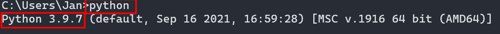
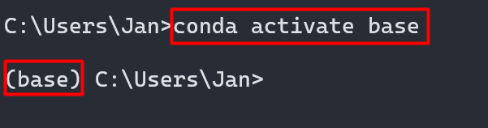
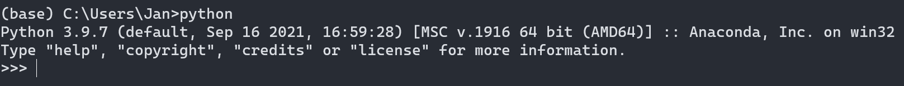
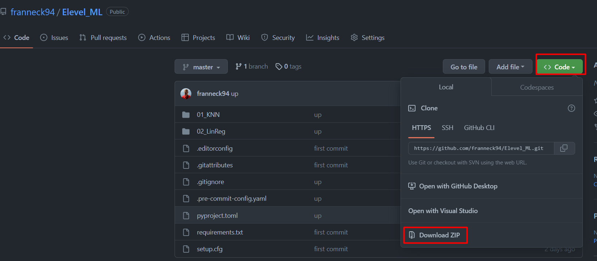
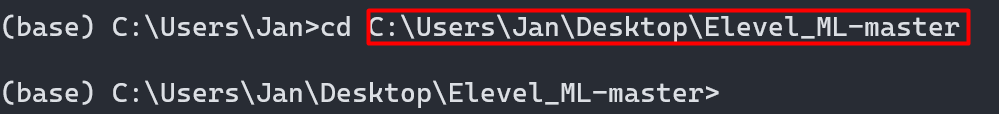
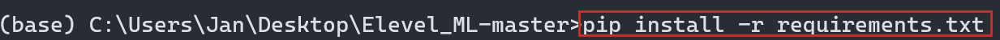
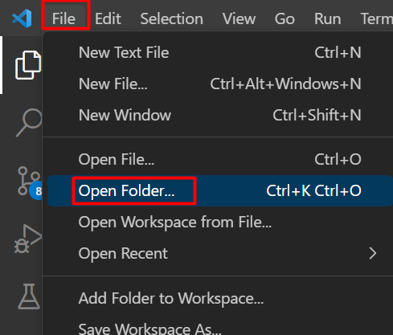
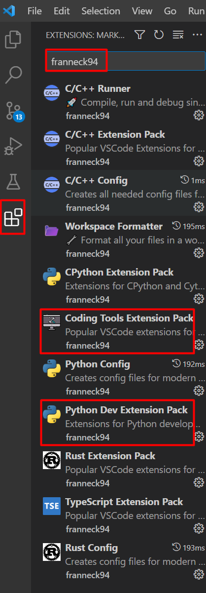

# Software Installation

## Python

### Installation von Python

Wir benötigen Python 3.8 (oder neuer).  
Vielleicht ist bei euch Python schon installiert.  
Dies könnt ihr wie folgt überprüfen:

Wenn der Python Befehl nicht funktioniert, dann habt ihr Python nicht nicht installiert.  
Dann können wir z.B. [Anaconda](https://www.anaconda.com/products/distribution) installieren.

Danach können wir das installierte Python von Anaconda so starten:

### Installation der Python Pakete

Zuerst das Projekt von dem Web-Seminar herunterladen:

<https://github.com/franneck94/Elevel_ML>

Die ZIP könnt ihr entpacken wo ihr wollt, z.B. auf dem Desktop.

Jetzt im Terminal in den Ordner wechseln:

Jetzt können wir die Python Pakete installieren:

Danach rattert Python die Pakete durch die installiert werden müssen.

## Editor (Visual Studio Code)

### Installation

Zu guter letzt installieren wir ein Tool in dem wir den Python Code schreiben werden.  
Das Tool ist [VSCode](https://code.visualstudio.com/) welches der meistgenutze Code Editor ist.  
Die Installation ist typisch für euer Betriebssystem (auf Windows z.B. eine Installer-Exe).  

### Einrichtung

Beim ersten Start von VSCode bekommt ihr eine Willkommensnachricht, wenn ihr dort etwas nicht versteht, könnt ihr das auch einfach weg-clicken.

Dann geht es jetzt darum das entpackte Projekt in VSCode zu öffnen.
Navigiert dorthin, wo ihr das Projekt habt und öffnet es.

Der letzte Schritt ist jetzt die Installation von Erweiterungen in VSCode.

Alle weiteren Schritte werden dann im Web-Seminar besprochen 😊
